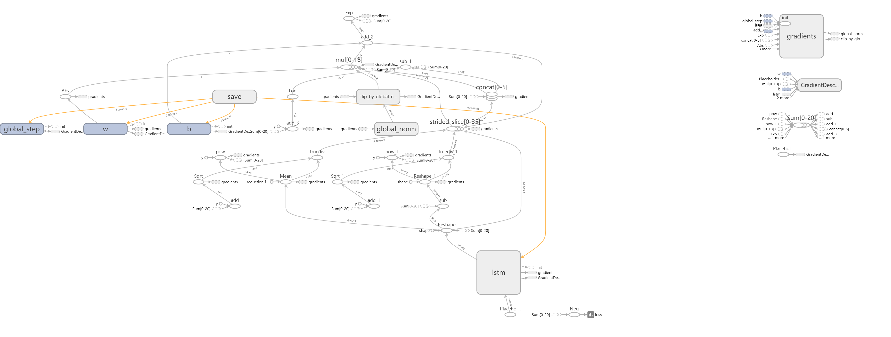

# CSTR VCTK Corpus <!-- omit in toc -->
[CSTR VCTK数据集](https://datashare.is.ed.ac.uk/handle/10283/2651)是由爱丁堡大学维护的一组语音数据, 里面包含109位以英语为母语的说话者, 每位说话者会读出400多句英文句子. 本次实验使用该数据集进行文本独立说话者鉴别(TI-SV)训练.

## Index <!-- omit in toc -->
- [导入数据](#导入数据)
- [建立模型](#建立模型)
- [训练模型](#训练模型)
- [评估模型](#评估模型)

## 导入数据
解压下载下来的数据集`VCTK-Corpus.zip`, 然后对音频文件用librosa库进行MFCC特征提取. 并保存为.npy格式的文件至指定文件夹, 其中每个文件表示一位说话者的所有口语的声纹特征. 15G的音频文件经过特征提取后大小缩小为2G左右.  
需要注意的是要用 `find <dataset_dir> -name "*raw" -delete` 命令删除数据集中的.raw文件, 否则会遇到如下错误:

```
File "data_preprocess.py", line 139, in 
save_spectrogram_tisv()
File "data_preprocess.py", line 112, in save_spectrogram_tisv
utter, sr = librosa.core.load(utter_path, config.sr) # load utterance audio
File "/usr/local/lib/python3.5/dist-packages/librosa/core/audio.py", line 112, in load
with audioread.audio_open(os.path.realpath(path)) as input_file:
File "/usr/local/lib/python3.5/dist-packages/audioread/init.py", line 116, in audio_open
raise NoBackendError()
audioread.NoBackendError
```

## 建立模型
该实验使用的是3层LSTM网络. 实验模型如图所示:  


## 训练模型
执行`python main.py --train True`命令. 训练过程中loss变化如图所示:  


## 评估模型
执行`python main.py --train False`命令, 得到结果为:  
```
model path : ./tisv_model
ckpt file is loaded ! ./tisv_model/Check_Point/model.ckpt-6
test file path :  ./test_tisv
inference time for 40 utterences : 0.23s
[[[ 0.85 -0.14 -0.42  0.29]
  [ 0.87 -0.12 -0.32  0.43]
  [ 0.93 -0.13 -0.32  0.47]
  [ 0.89  0.03 -0.2   0.57]
  [ 0.82 -0.11 -0.35  0.18]]

 [[-0.17  0.84  0.07  0.06]
  [-0.27  0.78  0.1   0.04]
  [-0.38  0.81  0.21 -0.07]
  [-0.25  0.79  0.02  0.03]
  [-0.17  0.86  0.02  0.02]]

 [[-0.17  0.15  0.95 -0.11]
  [-0.47  0.21  0.77  0.02]
  [-0.36  0.13  0.72 -0.26]
  [-0.39  0.42  0.79 -0.27]
  [-0.35  0.15  0.89 -0.23]]

 [[ 0.57  0.1  -0.17  0.88]
  [ 0.47 -0.02 -0.22  0.68]
  [ 0.46 -0.03 -0.22  0.68]
  [ 0.49  0.09 -0.13  0.8 ]
  [ 0.4   0.13 -0.09  0.82]]]

EER : 0.00 (thres:0.58, FAR:0.00, FRR:0.00)
```
即等错误率(ERR)为0.