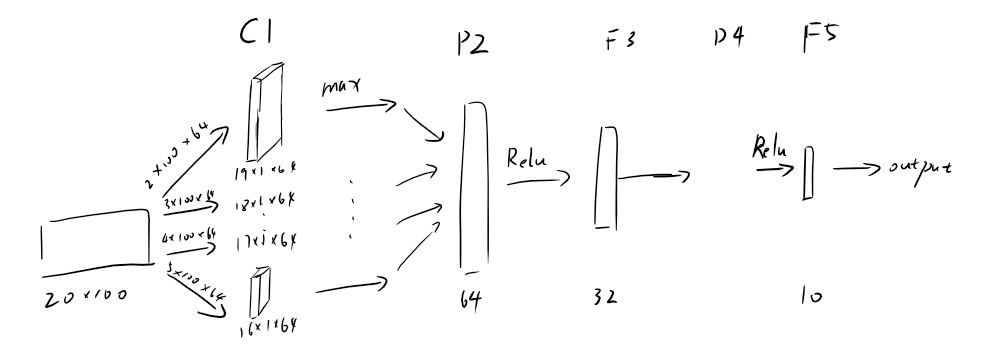

# numbersRec <!-- omit in toc -->
这是一个不知道从哪里来的英文语音数据集, 里面包括3891个不同人说的英文数字0~9. 本次实验使用numbersRec实验数据集进行英文语音识别训练.

## Index <!-- omit in toc -->
- [导入数据](#导入数据)
- [建立模型](#建立模型)
  - [卷积层(C1)](#卷积层c1)
  - [池化层(P2)](#池化层p2)
  - [全连接层(F3)](#全连接层f3)
  - [Dropout层(D4)](#dropout层d4)
  - [全连接层(F5)](#全连接层f5)
- [训练模型](#训练模型)
- [评估模型](#评估模型)

## 导入数据
数据集中音频文件命名为`0_Victoria_400.wav`, 其格式符合`%ans_%name_%num.wav`的形式, 其中`%ans`为该音频中说出的英文数字.   
本次实验将numbersRec划分成70%的训练集, 20%的验证集, 10%的测试集. 将%res作为label并以one-hot编码, 并对音频文件用librosa库进行MFCC特征提取.

## 建立模型
此处使用多种尺寸的卷积核的CNN模型, 该模型如图所示:  


### 卷积层(C1)
```python
filter_sizes = [2,3,4,5]  # 卷积核尺寸
for i, filter_size in enumerate(self.config.filter_sizes):
    conv = tf.layers.conv1d(input_x, self.config.num_filters, filter_size, activation=tf.nn.relu)
```
训练时输入数据为 20\*100 向量. 训练时有四类卷积核, 分别为 2\*100\*64, 3\*100\*64, 4\*100\*64 和 5\*100\*64. 取默认步长为1, 填充方式为`VALID`. 得到卷积结果为 19\*1\*64, 18\*1\*64, 17\*1\*64 和 16\*1\*64. 最后再以relu为激活函数.

### 池化层(P2)
```python
pooled = tf.reduce_max(conv, reduction_indices=[1])
pooled_outputs.append(pooled)
```
P2层对卷积层C1输出降维取最大值, 各自得到长度为 64 的向量, 最后通过`append()`得到长度为 256 的向量.

### 全连接层(F3)
```python
num_filters_total = self.config.num_filters * len(self.config.filter_sizes)  # 64*4

pooled_reshape = tf.reshape(tf.concat(pooled_outputs, 1), [-1, num_filters_total])

fc = tf.layers.dense(pooled_reshape, self.config.hidden_dim, activation=tf.nn.relu, name='fc1')
```
P2层输出经过reshape后由全连接层处理输出长度为 32 的向量. 其中`reshape()`中 -1 代表缺省参数, 除剩下的值就会赋给它.

### Dropout层(D4)
```
fc = tf.contrib.layers.dropout(fc, self.keep_prob)
```
以self.keep_prob的概率保留神经元, 在这里取值为1.

### 全连接层(F5)
```python
self.logits = tf.layers.dense(fc, num_classes, name='fc2')
```
该全连接层输出长度为 10 的向量, 即该段音频为这10个数字的概率.

## 训练模型
如下图所示, 蓝线为验证时loss, 橙线为训练时loss:  


## 评估模型
最终结果为

```
test_loss:0.18094511 test accuracy:0.96741855
```

即准确率为97.24%  

加载训练好的模型后以test文件夹中的10个音频文件作为输入测试, 得到结果为:
```
===============
真实lable: 3
识别结果为:3
===============
真实lable: 8
识别结果为:8
===============
真实lable: 4
识别结果为:4
===============
真实lable: 7
识别结果为:7
===============
真实lable: 1
识别结果为:1
===============
真实lable: 6
识别结果为:2
===============
真实lable: 0
识别结果为:0
===============
真实lable: 9
识别结果为:9
===============
真实lable: 5
识别结果为:5
Congratulation!
```
即全部通过.