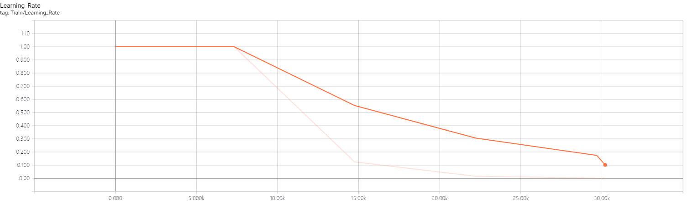

# Penn Treebank <!-- omit in toc -->
Penn Treebank(PTB, 点[这里下载](http://www.fit.vutbr.cz/~imikolov/rnnlm/simple-examples.tgz))是NLP中常用的语料库, 本次实验对PTB使用RNN训练一个语言模型.

## Index <!-- omit in toc -->
- [导入数据](#导入数据)
- [建立模型](#建立模型)
- [训练与评估模型](#训练与评估模型)

## 导入数据
首先建立一个 *单词->数字* 的映射(词典), 分别将PTB数据集中训练集, 验证集和测试集的词汇转化为数字列表. 然后以`batch_size`切分得到的数字列表并将多余部分舍去.

## 建立模型
程序总体框架如图所示:  
  
模型如图所示:  
  
从图中我们可以看到在模型中RNN设置了多层cell, 

```python
def make_cell():
    cell = tf.contrib.rnn.LSTMBlockCell(config.hidden_size, forget_bias=0.0)
    cell = tf.contrib.rnn.DropoutWrapper(cell, output_keep_prob=config.keep_prob)
    return cell

inputs = tf.nn.dropout(inputs, config.keep_prob)
cell = tf.contrib.rnn.MultiRNNCell([make_cell() for _ in range(2)], state_is_tuple=True)
```

从代码中我们可以知道其实为双层`LSTMBlockCell`. 除此以外模型还为接入数据和LSTM加上了dropout层.  
然后再加上softmax分类层. 

```python
softmax_w = tf.get_variable("softmax_w", [size, vocab_size], dtype=data_type())
softmax_b = tf.get_variable("softmax_b", [vocab_size], dtype=data_type())
logits = tf.nn.xw_plus_b(output, softmax_w, softmax_b)
```

最后使用梯度截断更新学习率.

<!-- ```python

``` -->

## 训练与评估模型
训练过程中loss与learning_rate如图所示:  
   

最后得到`perplexity`值为 114.770