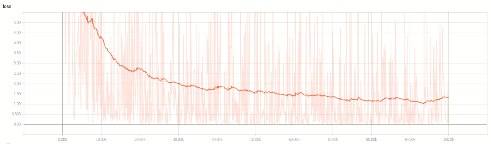

# Dogs vs. Cats <!-- omit in toc -->
[Cats vs. Dogs](https://www.kaggle.com/c/dogs-vs-cats)是Kaggle大数据竞赛2013年的一道赛题, 利用给定的数据集, 用算法实现猫和狗的识别. 这里使用Google提供的Slim库来进行迁移学习.  

## Index <!-- omit in toc -->
- [导入数据](#导入数据)
- [训练模型](#训练模型)
- [验证模型](#验证模型)

## 导入数据
0. 从tensorflow官方的[repo:model](https://github.com/tensorflow/models)中下载`research/slim`文件夹
1. 从kaggle官方下载[Cats vs. Dogs](https://www.kaggle.com/c/dogs-vs-cats)数据集, 里面包含25000张图片, 其中猫和狗的图片各12500张, 在这里我们各划分10000张图片作为训练集, 2500张图片为验证集. 
   <!-- ```
    dataset/
    |---dogsVScats_origin/
    |-------train/
    |-----------cat/
    |-----------dog/
    |-------validation/
    |-----------cat/
    |-----------dog/
   ``` -->
2. 数据转化为 *tfrecord* 格式: 
    ```
    python build_image_data.py ^
    --train_directory .\dogsVScats_origin\train ^
    --validation_directory .\dogsVScats_origin\validation ^
    --output_directory ..\dogsVScats\data ^ 
    --labels_file .\dogsVScats_origin\label.txt
    ```
3. 在`dataset_factory.py`中注册dogsVScats数据集.

## 训练模型
0. 下载预训练好的[Inception V3模型](http://download.tensorflow.org/models/inception_v3_2016_08_28.tar.gz)并放置于对应位置.
1. 运行`train_image_clssifier.py`文件对其进行训练 (GTX1070 大概跑了一晚上, train_dir目录下生成17.5G的数据)

训练过程中loss变化如下图所示:  


## 验证模型
运行验证脚本`eval_image_clssifier.py`, 得到最终验证结果为: 
```
eval/Accuracy[0.9874]
eval/Recall_5[1]
```

即训练出的模型准确率为98.74%, ~~~Top5正确率为100%~~~(这里只有两类, 肯定识别结果落在前5了额>_<>)